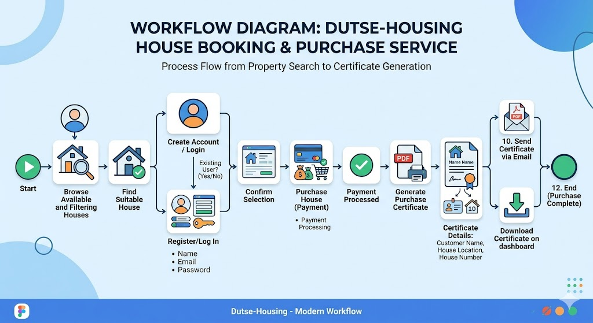

# 🏠 Dutse Housing — User Guide & Operations Manual



Welcome to **Dutse Housing**, a premium, high-end minimalist real estate portal. Our platform allows users to browse premium local property listings in Dutse and complete purchases securely using an elegant, simulated local account balance and secure 4-digit PIN system, completely bypassing expensive third-party payment processors like Stripe.

---

## 💡 Non-Developer Quick Start: How Does It Work?

If you are a non-developer, think of this application as having two simple parts that work together to create a realistic property marketplace:

1. **The Web Portal (Vite)**: The beautiful visual website where users browse property cards, view architectural details, manage accounts, request simulated balance deposits, and buy listings.
2. **The Backend Manager (Express & MongoDB)**: The core brain that keeps track of active users, saved listings, processes deposits/purchases, and generates official horizontal print certificates.

Rather than copying long, complicated credit card numbers, you complete checkouts on the website using a secure **4-digit PIN** (just like at an ATM!).

---

## ⚙️ How to Start the Application (Step-by-Step)

To run the platform, you need to start the 2 components. Open **two separate terminal windows** on your computer and run one command in each:

### Terminal 1: Start the Backend Manager

This component handles user accounts, database state, property listings, and certificate downloads.

```bash
# Navigate to server directory
cd server

# Install backend dependencies
npm install

# Start the Express server
node index.js
```

_You will see:_ `Server running on port 5000` and `MongoDB connected`

### Terminal 2: Start the Web Portal

This component hosts the actual website interface.

```bash
# Navigate to web directory
cd web

# Install frontend dependencies
npm install

# Start the Vite React client
npm run dev
```

_You will see:_ `Vite server running at http://localhost:5173/`

Now, open your web browser and go to **[http://localhost:5173](http://localhost:5173)** to explore the platform!

---

## 💳 Step-by-Step Deposit & Purchase Instructions

To buy a property on the portal, follow these simple steps to allocate simulated money and complete the purchase:

### Step 1: Sign Up & Configure a Payment PIN (Customer)
1. Navigate to the website **[http://localhost:5173/register](http://localhost:5173/register)** and create a new customer account (e.g. `david@example.com`).
2. Once registered and logged in, you will be directed to your customer **Dashboard**.
3. Under the **Set Payment PIN** section, enter a secure **4-digit numeric PIN** (e.g. `1234`) and click **Save Payment PIN**.

### Step 2: Request a Deposit (Customer)
1. On your customer **Dashboard**, find the **Request Deposit** section.
2. Enter the dollar amount you would like to request (e.g. `250000` for $250,000.00).
3. Type in your secure **4-digit PIN** to authenticate the deposit request.
4. Click **Request Deposit**. The request will be recorded and marked as `Pending`.

### Step 3: Approve the Deposit (Administrator)
1. Log out of your customer account.
2. Go to **[http://localhost:5173/login](http://localhost:5173/login)** and sign in as the administrator using the default credentials:
   - **Email**: `admin@example.com`
   - **Password**: `adminpassword`
3. Click the **Admin Panel** link in the navigation bar.
4. Select the **Pending Deposits** tab.
5. You will see the customer's request. Click **Approve** to instantly credit the user's ledger balance.

### Step 4: Complete the Purchase
1. Log out of the admin account and sign back in as the customer (`david@example.com`).
2. Go to the home page, select a property card (e.g. **Stunning Beachfront Manor**), and click **View Details**.
3. In the purchase module, enter your **4-digit PIN** (`1234`) and click **Buy Property**.
4. Upon confirmation, you will be redirected to the **Success Page**, and your new real estate asset will show up in your **Dashboard** with a green **Paid** badge and a downloadable, beautifully styled horizontal PDF certificate of ownership!

---

## 🏗️ Technical Architecture Details

- **Database**: Monolithic MongoDB storage representing standard Mongoose schemas.
- **Security**: PINs are hashed using bcrypt on the server before storage. Authentication is done via standard JSON Web Tokens (JWT).
- **PDF Generation**: Dynamic landscape-oriented PDF documents with thick-and-thin outer borders and classic serif typography generated on the server using `pdfkit`.
